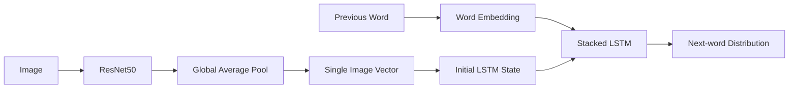
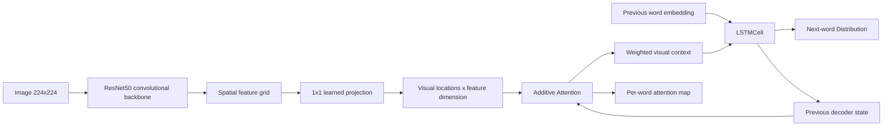

# CaptionLab — Explainable Image Captioning

[](https://github.com/SahilBh01r1769/image-captioning/actions/workflows/tests.yml)
[](https://github.com/SahilBh01r1769/image-captioning/actions/workflows/demo-smoke.yml)

**A deep-learning image-captioning project built to answer two questions at once: _what should the model say about an image, and where was it looking when it chose each word?_**

The repository keeps the original **ResNet50 → global image vector → LSTM** captioner as an ablation baseline, then extends it into a spatially explainable architecture that preserves the CNN feature grid and applies **learned additive attention at every decoding step**.

The result is not just a caption generator. It is a small research-oriented captioning lab with staged transfer learning, beam search, attention regularization, token-level confidence, alternative hypotheses, reproducible evaluation, and a Streamlit interface that can visualize word-by-word attention when a custom checkpoint is available.

> **Evaluation policy:** this README does not advertise example BLEU/METEOR values as achieved results. Model-quality numbers should be added only after running `evaluate.py` against a specific saved checkpoint and test split.

---

## Why this is more than a CNN + LSTM tutorial

| Component | What it adds |
|---|---|
| **Baseline architecture** | A simple global-image-vector encoder/decoder for controlled comparison |
| **Spatial ResNet50 encoder** | Preserves the final visual feature grid instead of averaging the image into one vector |
| **Additive attention** | Learns a different weighting over image regions for each generated word |
| **Attention coverage regularization** | Encourages the decoder to distribute visual attention across meaningful regions during a caption |
| **Progressive CNN fine-tuning** | Starts from ImageNet features, then unfreezes the backbone at a reduced learning rate |
| **Greedy + beam decoding** | Compares fast local decoding with multi-hypothesis sequence search |
| **Token evidence** | Returns per-token softmax confidence and spatial attention maps for the custom attention model |
| **Image-level data split** | Keeps every caption belonging to an image inside one split, preventing cross-split image leakage |
| **Evaluation diagnostics** | BLEU-1…4, METEOR-lite, caption length, Distinct-1/2, and mean token confidence |
| **Interactive CaptionLab** | Upload an image, inspect caption alternatives, and visualize custom attention maps |

---

## Architecture

### 1. Original baseline



This architecture is intentionally retained because it gives the attention model a meaningful baseline: all visual information must be compressed before language generation begins.

### 2. Explainable attention model



For a standard 224×224 input, the final ResNet feature map retains a spatial grid rather than being globally pooled. During decoding, the recurrent hidden state queries those visual locations using Bahdanau-style additive attention. The returned attention weights can be reshaped and projected back onto the image for inspection.

---

## The central idea: explain the caption word by word

A conventional caption such as:

```text
"a dog running through grass"
```

only tells us the final output. The attention model can additionally expose the visual weighting used at each step:

```text
"dog"      → stronger weight around the animal
"running"  → decoder focus may spread across pose / motion-related regions
"grass"    → stronger weight on the surrounding ground / texture
```

These maps are **model attention weights, not object-detection boxes and not proof of causal explanation**. Their value is diagnostic: they let us inspect whether the language decoder is visually grounding its word choices in plausible regions.

---

## Training objective

Caption training uses teacher forcing with cross-entropy over the next word. For the attention architecture, the total objective also includes a coverage term inspired by *Show, Attend and Tell*:

```text
loss = caption_cross_entropy + λ × attention_coverage_loss
```

Padding steps are masked out of the regularizer so artificial `<PAD>` positions do not influence spatial coverage.

The CNN backbone starts frozen. After the configured warm-up period, it is unfrozen and optimized at a lower learning rate than the captioning layers.

---

## Repository structure

```text
.
├── attention_model.py          # spatial CNN + additive attention + LSTMCell
├── model.py                    # original global-vector baseline
├── train.py                    # dual-architecture training pipeline
├── inference.py                # greedy/beam decoding + token evidence
├── evaluate.py                 # reproducible test-split evaluation
├── dataset.py                  # Flickr8k loading + image-level split
├── vocabulary.py               # tokenization, vocabulary and GloVe support
├── metrics.py                  # BLEU, METEOR-lite and diversity diagnostics
├── config.py                   # architecture/training/inference settings
├── demo/
│   ├── app.py                  # CaptionLab Streamlit UI
│   ├── README.md
│   └── requirements.txt
├── tests/
│   ├── test_attention_model.py
│   └── test_data_and_metrics.py
├── .github/workflows/
│   ├── tests.yml
│   └── demo-smoke.yml
├── image_captioning_walkthrough.ipynb
├── requirements.txt
└── requirements-dev.txt
```

The notebook is retained as a walkthrough/reference; the Python modules above are the source of truth for the current architecture.

---

## Setup

### 1. Clone and create a Python 3.11 environment

```bash
git clone https://github.com/SahilBh01r1769/image-captioning.git
cd image-captioning
python -m venv venv
```

Windows PowerShell:

```powershell
venv\Scripts\Activate.ps1
```

Linux/macOS:

```bash
source venv/bin/activate
```

### 2. Install

```bash
python -m pip install --upgrade pip
pip install -r requirements.txt
```

For tests:

```bash
pip install -r requirements-dev.txt
```

---

## Dataset

The training pipeline expects the Flickr8k Kaggle-style layout:

```text
data/
└── Flickr8k/
    ├── Images/
    │   ├── 1000268201_693b08cb0e.jpg
    │   └── ...
    └── captions.txt
```

One image has multiple reference captions. The split is performed **by image key**, not by flattened `(image, caption)` rows, so captions for the same image cannot appear in both training and evaluation sets.

The split is deterministic using the configured random seed. Because this repository uses its own seeded 80/10/10 image split, metrics should not be compared directly with papers using a different Flickr8k split protocol unless the split definitions are aligned.

---

## Optional GloVe initialization

Place:

```text
data/glove/glove.6B.200d.txt
```

The vocabulary loader reads only vectors required by the current vocabulary rather than holding the entire embedding file in memory. If the external GloVe dimensionality differs from the decoder embedding size, a deterministic projection initializes the caption embedding table.

Training can also run without GloVe:

```bash
python train.py --no_glove
```

---

## Train

### Attention model — primary research path

```bash
python train.py --architecture attention
```

### Global-vector baseline

```bash
python train.py --architecture baseline
```

### Custom run

```bash
python train.py --architecture attention --epochs 20 --batch_size 32 --lr 3e-4
```

### Resume

```bash
python train.py --architecture attention --resume models/attention_epoch_10.pth
```

Checkpoints store their architecture identifier, so inference/evaluation can reconstruct the correct model automatically.

---

## Inference

```bash
python inference.py --image path/to/image.jpg --beam_size 5
```

Or process a directory:

```bash
python inference.py --image_dir path/to/images --beam_size 5
```

For the custom attention checkpoint, decoding internally retains:

- caption text,
- length-normalized beam score,
- each generated token,
- token softmax confidence,
- flattened spatial attention weights.

That structured evidence is what the Streamlit UI uses to render word-level attention overlays.

---

## Evaluation

```bash
python evaluate.py --model models/best_model.pth --beam_size 5
```

Quick smoke evaluation:

```bash
python evaluate.py --model models/best_model.pth --beam_size 3 --max_images 100
```

Results are written to:

```text
outputs/evaluation_results.json
```

Reported diagnostics include:

- cumulative BLEU-1 / BLEU-2 / BLEU-3 / BLEU-4,
- **METEOR-lite** — explicitly an exact/stem-match approximation, not full WordNet METEOR,
- mean generated caption length,
- Distinct-1 and Distinct-2 lexical diversity,
- mean selected-token confidence when available.

No metric should be treated as sufficient by itself: caption quality includes correctness, grounding, fluency and diversity, and automatic n-gram overlap captures only part of that.

---

## CaptionLab demo

Run locally:

```bash
pip install -r demo/requirements.txt
streamlit run demo/app.py
```

### When a custom checkpoint is present

If both of these exist:

```text
models/best_model.pth
models/vocabulary.pkl
```

CaptionLab runs the repository checkpoint. For an attention model it displays word-level attention overlays and token confidence.

### Hosted fallback

Large custom checkpoints are intentionally not committed to Git. A public demo therefore falls back to **Microsoft `git-base-coco`**, a COCO-finetuned Generative Image-to-text Transformer distributed under the MIT license, and labels it prominently as a third-party reference model.

That fallback exists to make the interface immediately interactive; it is **not** used as evidence that the repository trained GIT or achieved GIT's published metrics.

See [`demo/README.md`](demo/README.md) for deployment details.

---

## Testing and CI

```bash
python -m pytest -q
```

The clean-runner tests do not require Flickr8k or ImageNet downloads. They validate:

- additive-attention normalization,
- attention decoder output shapes,
- padding-aware coverage regularization,
- spatial encoder behavior using an untrained offline backbone,
- deterministic and disjoint image-level splitting,
- vocabulary encode/decode behavior,
- BLEU / METEOR-lite sanity,
- caption-diversity bounds.

A separate workflow starts the Streamlit application and checks its health endpoint without forcing a heavyweight reference-model download.

---

## Research directions worth testing next

The repository is structured to support experiments rather than claiming that the first configuration is optimal. Useful next comparisons include:

1. **Global vector vs spatial attention** under exactly the same data split and decoder vocabulary.
2. **Attention regularization ablation** (`λ = 0` vs non-zero coverage penalty).
3. **Frozen vs progressively fine-tuned CNN** to measure whether visual adaptation helps on Flickr8k.
4. **Greedy vs beam search** across caption quality and diversity, not only BLEU.
5. **Attention failure analysis**: inspect confident but visually mis-grounded words.
6. **Transformer decoder ablation** while keeping the same spatial encoder/evaluation protocol.
7. **Scheduled sampling** to study teacher-forcing exposure bias.
8. **Modern semantic metrics** (for example BERTScore/CLIPScore) alongside n-gram metrics, with versions and protocol pinned.

---

## What can safely be claimed

This repository demonstrates:

- a trainable PyTorch image-captioning pipeline,
- a ResNet50 transfer-learning encoder,
- an original baseline and a spatial attention extension,
- word-conditioned visual attention maps,
- LSTM/LSTMCell autoregressive decoding,
- teacher forcing and attention regularization,
- staged CNN fine-tuning,
- greedy and beam-search inference,
- reproducible image-level data splitting,
- checkpoint-aware inference/evaluation,
- unit-tested deep-learning components,
- an interactive caption-analysis interface.

It does **not** claim a specific BLEU/METEOR score, state-of-the-art performance, or a custom-trained public checkpoint until those results are reproduced and committed as evaluation artifacts.

---

## References

- Vinyals et al., **Show and Tell: A Neural Image Caption Generator** (2015)
- Xu et al., **Show, Attend and Tell: Neural Image Caption Generation with Visual Attention** (2015)
- Bahdanau et al., **Neural Machine Translation by Jointly Learning to Align and Translate** (2015)
- Pennington et al., **GloVe: Global Vectors for Word Representation** (2014)
- Wang et al., **GIT: A Generative Image-to-text Transformer for Vision and Language** (2022) — hosted reference demo only

---

## License / model attribution note

Flickr8k, GloVe, ImageNet-pretrained ResNet weights, and the optional Microsoft GIT reference checkpoint are third-party resources with their own terms. This repository's code should not be interpreted as transferring ownership or licensing rights for those assets.
